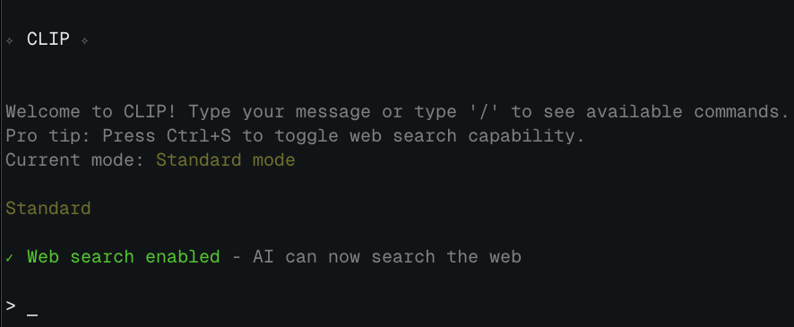

# CLIP - Command Line Interface for Prompting

> [!NOTE]
> This project is currently a work in progress. Feel free to star the repository to stay updated on new features and improvements. Feedback and suggestions are always welcome!

CLIP is a command-line interface to chat with LLM models that supports OpenAI's Response API.


## Features

- **Conversation Management**: Tracks conversation context for follow-up questions
- **Context Pause/Resume**: Pause conversations and resume them later with the `/continue` command
- **Conversation-Based History**: Responses are grouped by conversation for better organization
- **Web Search Capability**: Optionally enable web search for up-to-date information
- **Command Interface**: Intuitive slash commands with autocomplete
- **Response ID Tracking**: Uses OpenAI's response IDs for conversation continuity


<div align="center">
  <a href="https://rbadillap.dev">
    
  </a>
</div>


## Technical Overview

CLIP is built as a personal tool using:

- Node.js
- [OpenAI's Responses API](https://platform.openai.com/docs/api-reference/responses)
- Terminal interface with readline

## Commands

The application supports these commands:

- `/help` - Show help information
- `/continue` - Resume conversation with the most recent response
- `/continue n` - Continue from response #n in the current conversation (e.g., `/continue 2`)
- `/history` - View the response history for the current conversation
- `/history --all` - View response history across all conversations
- `/new` - Start a new conversation with fresh context
- `/debug` - Show current conversation state (for troubleshooting)
- `/clear` - Clear the screen
- `/exit` - Exit the application

## Conversation Modes

CLIP offers two conversation modes:

1. **Standard mode** - Regular conversation with GPT
2. **Web search enabled** - Uses OpenAI's search tool for current information

## OpenAI Responses API Integration

CLIP uses OpenAI's [Responses API](https://platform.openai.com/docs/api-reference/responses) for conversation management, providing:

- Conversation continuity through response IDs
- Streaming response handling
- Support for tool usage (such as web search)
- Multi-turn conversation handling

## Debugging

CLIP includes a debugging system controlled through environment variables:

```bash
# Enable basic info level debugging
DEBUG=clipai node index.js

# Enable verbose level (more detailed output)
DEBUG=clipai:verbose node index.js

# Enable debug level (maximum detail)
DEBUG=clipai:debug node index.js
```

Each debugging level provides progressively more information about API interactions and application state.

## Data Storage

CLIP stores conversation data in a dedicated directory:

```
~/.clipai/
├── conversations/        # Conversation data organized by ID
├── responses/            # Response history organized by conversation
├── state.json            # Current application state
└── config.json           # User configuration
```

## License

[MIT](LICENSE)
